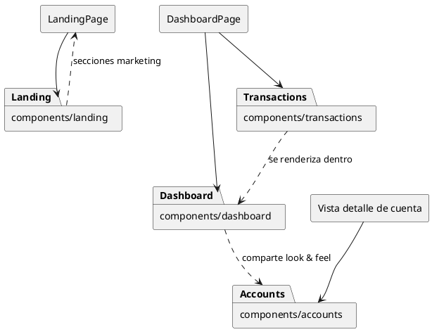

# Componentes compartidos

Este directorio agrupa los bloques visuales reutilizables de la aplicación web. Cada subcarpeta está pensada para un dominio (dashboard, landing, transacciones, etc.) y mantiene sus propias dependencias externas y hooks. La carpeta `ui/` contiene primitives de shadcn y fue omitida porque son componentes de bajo nivel.

## Mapa de carpetas

| Carpeta | Componentes incluidos | Se consumen en | Hooks destacados |
| --- | --- | --- | --- |
| `accounts/` | `AccountDetailHeader`, `AccountTypeIcon` | Preparados para vistas de detalle de cuentas (aún sin referencia activa) | Ninguno |
| `dashboard/` | `DashboardHeader`, `DashboardStatistics`, `AccountSelector` | `apps/web/src/app/(auth)/(dashboard)/dashboard/page.tsx` | `DashboardStatistics` usa `useFitText` para escalar el balance sin romper el layout |
| `landing/` | `LandingNavbar`, `Hero`, `Features`, `FeatureCard`, `HowItWorks`, `Security`, `CTA`, `Footer`, `SectionWrapper` | `apps/web/src/app/landing/page.tsx` | `LandingNavbar` usa `useState`/`useEffect` para el scroll y el menú móvil |
| `transactions/` | `QuickFilters`, `TransactionList`, `TransactionTable`, `TransactionCard`, `TransactionCategoryIcon`, `TransactionSkeleton` | Dashboard principal y listas de movimientos | `TransactionList` consume `useAccountTransactions` y controla un `IntersectionObserver` con `useRef`/`useEffect` |

## Diagrama de relación

Cada subdirectorio cuenta con su propio README con más detalle sobre props, usos concretos y hooks utilizados, además de diagramas específicos que muestran el flujo dentro de ese contexto.
