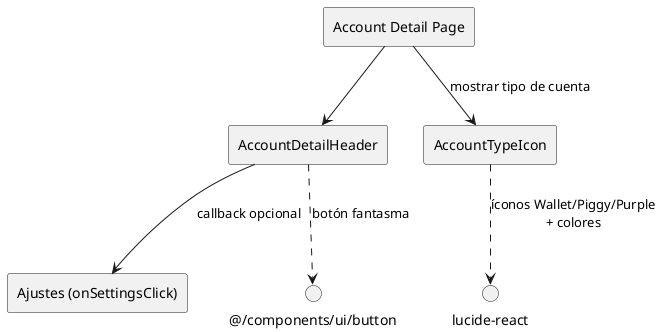

# Componentes de cuentas

Los componentes en `apps/web/src/components/accounts` están orientados a construir pantallas de detalle para cada cuenta financiera. Aunque todavía no se renderizan en las páginas actuales, sus props y estilos ya están listos para integrarse cuando se implemente la vista de cuenta.

## Inventario

| Componente | Descripción | Props clave | Uso actual | Hooks |
| --- | --- | --- | --- | --- |
| `AccountDetailHeader` | Encabezado compacto con CTA de ajustes para la vista de una cuenta específica. | `accountName`, `onSettingsClick`. | **Aún no se importa**; pensado para `app/(auth)/accounts/[id]/page.tsx` u otra ruta de detalle. | N/A |
| `AccountTypeIcon` | Mapea `AccountType` (`CHECKING`, `SAVINGS`, `CREDIT_CARD`) a íconos de `lucide-react` con tamaños y colores consistentes. | `type`, `size`, `className`. | **Aún no se importa**; se puede usar tanto en listas como en tarjetas de cuentas. | N/A |

### Hooks y dependencias relevantes

- Ambos componentes son puramente presentacionales; no usan hooks. Se apoyan en `@/components/ui/button`, en íconos de `lucide-react` y en utilidades como `cn`.
- Gracias a esa ausencia de hooks pueden renderizarse tanto en el servidor como en el cliente sin cambios.

## Diagrama

> Estado actual: la búsqueda (`rg AccountDetailHeader` o `rg AccountTypeIcon`) no devuelve importaciones fuera de esta carpeta, así que al integrarlos conviene documentar en el PR correspondiente dónde viven para mantener esta tabla al día.
