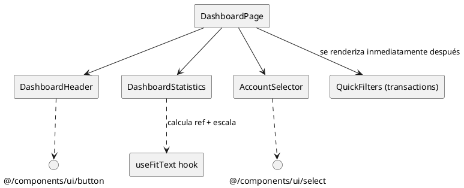

# Componentes de dashboard

Ubicación: `apps/web/src/components/dashboard`. Reúnen los elementos que conforman el hero del dashboard autenticado (encabezado, balance y selector de cuentas).

## Componentes

| Componente | Descripción y props destacadas | Se usa en | Hooks |
| --- | --- | --- | --- |
| `DashboardHeader` | Encabezado minimalista con el CTA hacia la configuración (`/settings`). Solo depende de `Button` y `Link`. | `apps/web/src/app/(auth)/(dashboard)/dashboard/page.tsx`. | N/A |
| `DashboardStatistics` | Renderiza balance total e ingresos/egresos (Badges). Props: `totalBalance`, `totalIncome`, `totalExpense`, `currency`. | Misma página del dashboard cuando existen estadísticas (`statistics && …`). | `useFitText` (`apps/web/src/hooks/useFitText.ts`) para escalar el texto del balance según el ancho disponible. |
| `AccountSelector` | Wrapper para `Select` que lista cuentas (`accounts: Account[]`) y envía cambios vía `onAccountChange`. Incluye opción "All Accounts". | Dashboard principal, junto a `QuickFilters`. | N/A |

### Detalles de hooks

- `useFitText` devuelve `{ref, scale}` y observa el ancho del elemento y su contenedor para mantener el balance en una sola línea. El `style={{ transform: scale }}` aplicado en `DashboardStatistics` evita desbordes sin recalcular fuentes manualmente.
- No hay otros hooks en la carpeta, lo que simplifica las pruebas y permite renderizar los componentes en el servidor si se requiere.

## Diagrama

Mantén este README sincronizado si el dashboard empieza a renderizar estos componentes en otras rutas (por ejemplo widgets embebidos) o si `useFitText` se reemplaza por otra solución responsiva.
