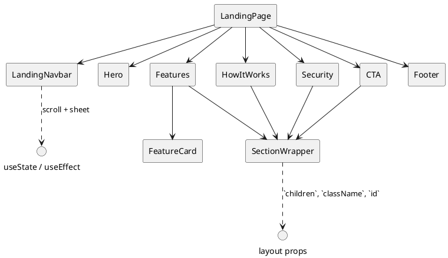

# Componentes de landing

Estos componentes construyen la página pública (`apps/web/src/app/landing/page.tsx`). Todos son presentacionales salvo la barra de navegación, que maneja estado para el menú móvil y el efecto transparente con el scroll.

## Inventario

| Componente | Rol | Se usa en | Hooks |
| --- | --- | --- | --- |
| `LandingNavbar` | Barra fija con links internos y menú móvil (`Sheet`). Cambia de fondo al hacer scroll. | Se monta al inicio de `LandingPage`. | `useState` (`isScrolled`, `isOpen`) y `useEffect` (listener de scroll). |
| `Hero` | Hero section con CTA y texto animado mediante `framer-motion`. | `LandingPage`. | N/A |
| `Features` | Lista de beneficios, utiliza `FeatureCard` y `SectionWrapper`. | `LandingPage`. | N/A |
| `FeatureCard` | Tarjeta individual con animaciones `framer-motion`. | Solo desde `Features`. | N/A |
| `HowItWorks` | Pasos secuenciales con `Card`. | `LandingPage`. | N/A |
| `Security` | Grilla de argumentos de seguridad. | `LandingPage`. | N/A |
| `CTA` | Llamado a la acción con gradientes animados. | `LandingPage`. | N/A |
| `Footer` | Información de marca, links y redes. | `LandingPage` (al final). | N/A |
| `SectionWrapper` | Contenedor reutilizable que aplica padding, ancho y opcionalmente `id` para navegar con anclas. | `Features`, `HowItWorks`, `Security`, `CTA`. | N/A |

### Dependencias relevantes

- `framer-motion` se usa para las animaciones de entrada/hover en `Hero`, `FeatureCard`, `Features`, `HowItWorks`, `Security` y `CTA` sin necesidad de hooks.
- `LandingNavbar` depende de `@/components/ui/button`, `@/components/ui/sheet` y `lucide-react` (`Menu`, `X`).

## Diagrama

Al añadir nuevas secciones públicas, reutiliza `SectionWrapper` para mantener consistencia de márgenes y documenta aquí el nuevo componente, indicando si introduce hooks adicionales (por ejemplo, un formulario con `useForm`).
