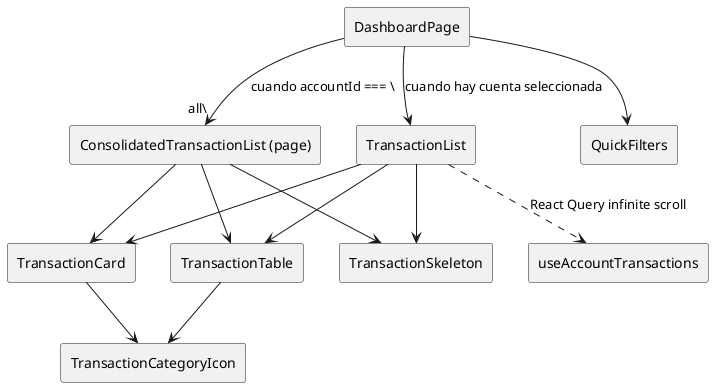

# Componentes de transacciones

Estos bloques soportan tanto la vista consolidada como las listas por cuenta del dashboard autenticado. Viven en `apps/web/src/components/transactions`.

## Componentes

| Componente | Descripción | Se usa en | Hooks |
| --- | --- | --- | --- |
| `QuickFilters` | Selector compacto (`Select`) que permite elegir el rango temporal (este mes, mes pasado, etc.). | `apps/web/src/app/(auth)/(dashboard)/dashboard/page.tsx` junto al `AccountSelector`. | N/A |
| `TransactionList` | Orquesta el infinite scroll: muestra tarjetas en móvil, tabla en escritorio y estados de loading/error/empty. Props: `accountId`, `filters`. | `dashboard/page.tsx` cuando se elige una cuenta específica. | `useAccountTransactions` (fetch paginado), `useRef` + `useEffect` para gestionar `IntersectionObserver` y disparar `fetchNextPage`. |
| `TransactionCard` | Tarjeta responsive para un movimiento (usa `TransactionCategoryIcon`, badges y formato de moneda). | Dentro de `TransactionList` y en `ConsolidatedTransactionList` (definido en la página de dashboard). | N/A |
| `TransactionTable` | Tabla detallada con `Table` shadcn; permite `onTransactionClick`. | `TransactionList` y `dashboard/page.tsx` (para la vista consolidada de escritorio). | N/A |
| `TransactionCategoryIcon` | Devuelve un emoji según `TransactionCategory` y tamaño pedido. | `TransactionCard` y `TransactionTable`. | N/A |
| `TransactionSkeleton` | Placeholders tanto en formato card como table (`variant`). | `TransactionList` y `dashboard/page.tsx` durante carga inicial. | N/A |

### Hooks y flujo de datos

- `useAccountTransactions` (en `apps/web/src/hooks/transactions/useAccountTransactions.ts`) encapsula la consulta paginada con React Query. `TransactionList` pasa `accountId` + filtros y recibe `data`, `fetchNextPage`, etc.
- El `IntersectionObserver` se crea dentro de `useEffect` y observa el `div` referenciado por `useRef`, evitando dependencias externas.
- `QuickFilters` no usa hooks, por lo que se puede renderizar en servidores o componentes RSC si hiciera falta.

## Diagrama

Mantén esta documentación actualizada si se agregan acciones (por ejemplo, edición en línea en la tabla) o si `TransactionList` empieza a compartir el hook con nuevas variantes (modal, slide-over, etc.).
