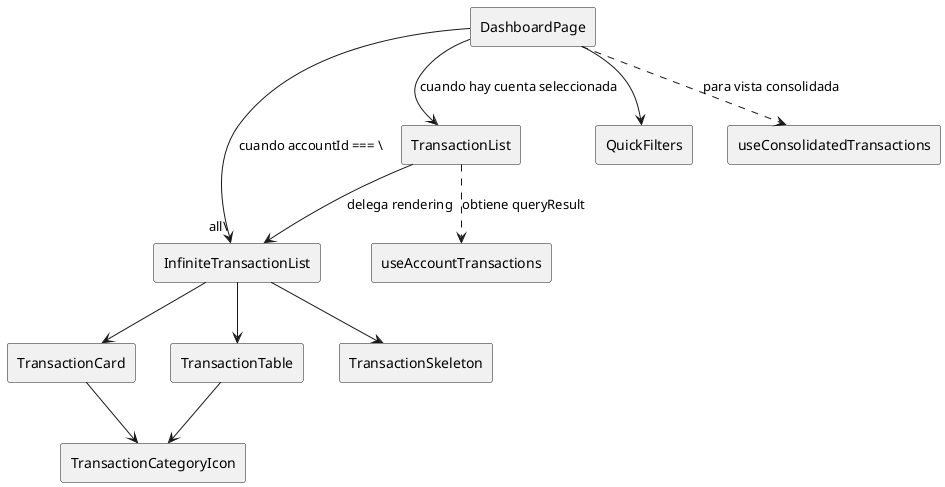

# Componentes de transacciones

Estos bloques soportan tanto la vista consolidada como las listas por cuenta del dashboard autenticado. Viven en `apps/web/src/components/transactions`.

## Componentes

| Componente | Descripción | Se usa en | Hooks |
| --- | --- | --- | --- |
| `QuickFilters` | Selector compacto (`Select`) que permite elegir el rango temporal (este mes, mes pasado, etc.). | `apps/web/src/app/(auth)/(dashboard)/dashboard/page.tsx` junto al `AccountSelector`. | N/A |
| `InfiniteTransactionList` | Componente genérico que orquesta infinite scroll con React Query. Recibe `queryResult` (de cualquier hook de transacciones), `filters` y `emptyMessage`. Muestra tarjetas en móvil, tabla en escritorio y estados de loading/error/empty. | Base para `TransactionList` y directamente en `dashboard/page.tsx` para vista consolidada. | `useRef` + `useEffect` para gestionar `IntersectionObserver` y disparar `fetchNextPage` del `queryResult`. |
| `TransactionList` | Wrapper que usa `useAccountTransactions` y pasa el resultado a `InfiniteTransactionList`. Props: `accountId`, `filters`. | `dashboard/page.tsx` cuando se elige una cuenta específica. | `useAccountTransactions` (fetch paginado). |
| `TransactionCard` | Tarjeta responsive para un movimiento (usa `TransactionCategoryIcon`, badges y formato de moneda). | Dentro de `InfiniteTransactionList` (usado por `TransactionList` y vista consolidada). | N/A |
| `TransactionTable` | Tabla detallada con `Table` shadcn; permite `onTransactionClick`. | Dentro de `InfiniteTransactionList` para vista de escritorio. | N/A |
| `TransactionCategoryIcon` | Devuelve un emoji según `TransactionCategory` y tamaño pedido. | `TransactionCard` y `TransactionTable`. | N/A |
| `TransactionSkeleton` | Placeholders tanto en formato card como table (`variant`). | Dentro de `InfiniteTransactionList` durante carga inicial. | N/A |

### Hooks y flujo de datos

- `useAccountTransactions` y `useConsolidatedTransactions` encapsulan consultas paginadas con React Query. Devuelven `UseInfiniteQueryResult` compatible con `InfiniteTransactionList`.
- `InfiniteTransactionList` es el componente base genérico que maneja infinite scroll. Recibe el resultado de cualquier hook de transacciones vía prop `queryResult`.
- `TransactionList` es un wrapper que usa `useAccountTransactions` internamente y delega todo a `InfiniteTransactionList`.
- El dashboard usa `InfiniteTransactionList` directamente para la vista consolidada, pasando el resultado de `useConsolidatedTransactions`.
- El `IntersectionObserver` se crea dentro de `useEffect` en `InfiniteTransactionList` y observa el `div` referenciado por `useRef`, evitando dependencias externas.
- `QuickFilters` no usa hooks, por lo que se puede renderizar en servidores o componentes RSC si hiciera falta.

## Diagrama

Mantén esta documentación actualizada si se agregan acciones (por ejemplo, edición en línea en la tabla) o si `InfiniteTransactionList` se usa en nuevos contextos (modal, slide-over, etc.).
